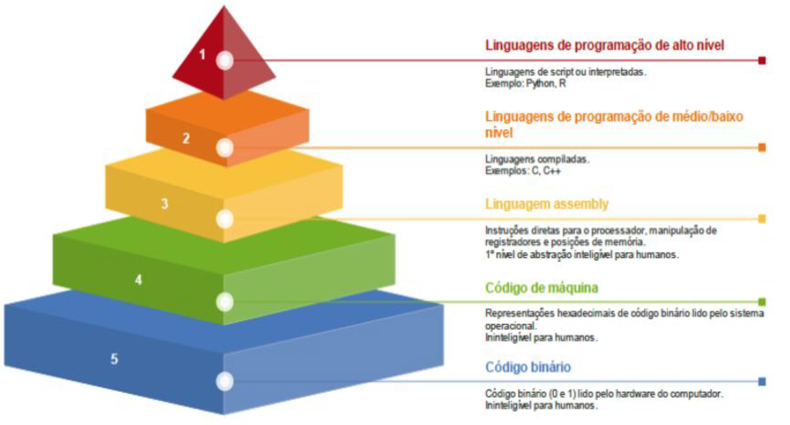
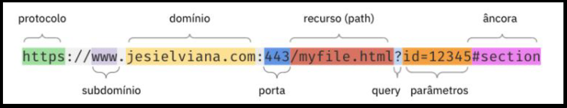
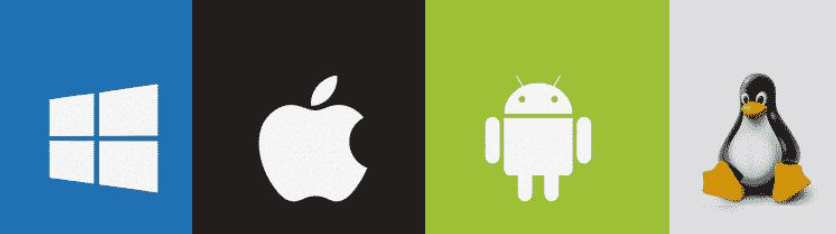
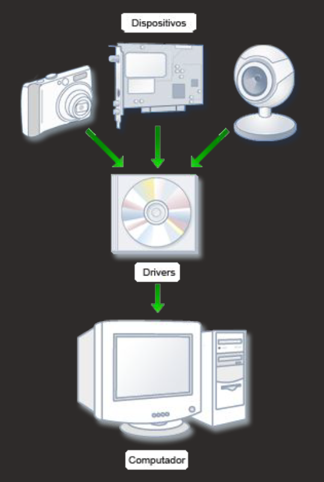
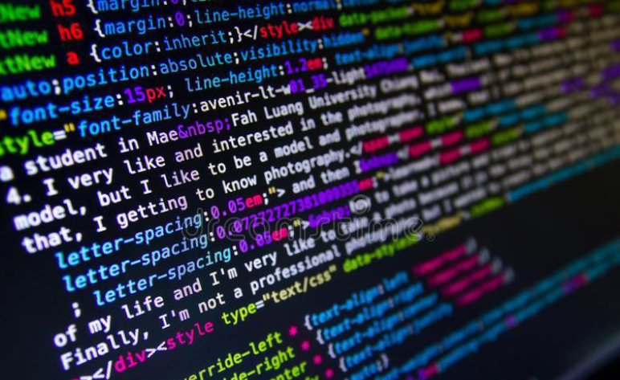
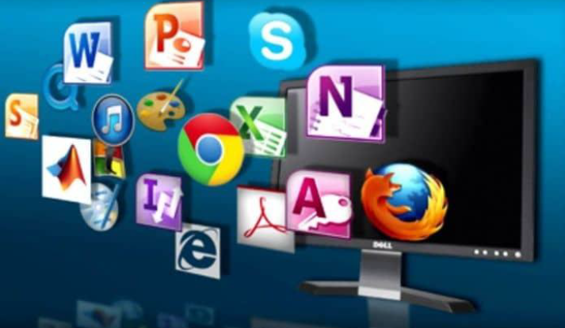

# Modulo 1 - Introdução, Sistemas e Aplicações

## Tópico 1 - Introdução à programação

### O que é programar?

- Um programa de computador é um produto que resulta da `atividade intelectual` de um programador. 
- Essa atividade depende de um treinamento prévio em `abstração` e `modelagem de problemas` (sua formulação e caminhos para a resolução), bem como o uso da lógica na verificação das soluções. 
- Esta atividade intelectual é traduzida em `instruções` para o computador, por meio de alguma linguage, que o faz executar operações que resolvam algum problema proposto.

Portanto, se quisermos dedfinir rapidamente o que é programar podemos dizer que: 
~~~
Programar é dar isntruções para que os computadores façam o que você quer que eles façam.
~~~

### Mas como a gente modela e resolve problemas na vida real?

- A atividade de programar consiste tanto na capacidade de `estruturar e resolver problemas` quanto na tradução dessa solução em `algoritmos` para a `codificação` em si.

### Para Assimilar:

~~~
Um algoritmos representa um conjunto de regras para a solução de um problema
~~~

### Mas como passamos essas instruções para o computador?

- Sabemos que progamar é dar instruções ao computador para ele fazer o que a gente quer que ele faça.
- Sabemos também que um algoritmo é uma forma de organizar em um conjunto de passos as operações para resolver um problema.

#### Resposta rápida: Por meio de uma `linguagem de programação`:

- As linguagens de programação são um método padronizado, formado por um conjunto de regras sintáticas e semânticas, que pode ser compilado ou interpretado e transformado em um programa de computador.

 

### O que é programar?

- Programar é dar `instruções` por meio de uma `linguagem de programação` para que os computadores executem a nossa `resolução de um problema`.

 

### Como Funciona a web?

- A internet é uma rede que interconecta computadores e outras redes de computadores e é composta por bilhões de dispositivos como servidores, roteadores, computadores e dispositivos móveis.
- Vários serviços funcionam sobre a infraestrutura da Internet como a telefonia (voz sobre IP) e World Wide Web.
- A World Wide Web é uma aplicação onde documentos e/ou páginas são interligadas através de links. É através dela que, por meio de um navegador e através de URLs, acessamos os sites e aplicações web.
- Os componentes básicos da Web são `clientes e servidores`.

 

#### Clientes 

- São os aparelhos que se conectam à Internet que `acessam` as páginas Web (por exemplo, seu smartphone conectado ao seu WI-FI).
- Geralmente as páginas Web são acessadas peloas navegadores Web (Chrome, Firefox, Brave, etc.) instalados nesses dispositivos.

 

#### Servidores

- São computadores que `armazenam` os arquivos que compõem os sites (por exemplo, documentos HTML, imagens, folhas de estilo, e arquivos JavaScript) e disponibilizam esses arquivos/páginas/sites para serem acessados pelos dispositivos clientes.
- Para isso, o servidor deve estar conectado a Internet, e assim, poderá ser acessado através do seu `endereço IP ou nome de domínio` (por exemplo, [startese](www.startse.com) ).

 

#### Mas como se comunicam?

- A comunicação entre dois ou mais dispositivos na Internet é realizada por meio endereços  conhecido como endereço IP) que identificam os dispositivos na rede e portas que fornecem pontos  e conexão para aplicações e serviços específicos.
- De forma resumida, para que um dispositivo A possa se comunicar com um dispositivo B, o  ispositivo A precisa saber o endereço IP de B e saber qual a porta de B está disponível para ele (oferece o serviço que ele espera).

Quando acessamos um determinado site a partir do nosso computador, informamos para o navegador o  ndereço do site, também conhecido como `URL` (Uniform Resource Locator). E o navegador se encarrega  e descobrir qual o endereço do servidor que armazena o site.

> URL é o endereço de um determinado recurso exclusivo na Web. Esse recurso pode ser uma página HTML, um documento CSS, uma imagem, um arquivo PDF, etc.

 

 

#### `PROTOCOLO` (obrigatório) : 

- Informa ao navegador qual o protocolo de comunicação, pode ser `http` ou `https`. 
- Quando não digitamos na barra de endereço o próprio navegador preenche.

#### `SUBDOMÍNIO` (opcional) : 

- Serve como uma extensão do nome de domínio, geralmente utilizado para disponibilizar diferentes sites/sistemas no mesmo domínio.

#### `DOMÍNIO` (obrigatório) : 

- É basicamente o nome (identificador) do site.
- DEVE ser informado pelo usuário na barra de endereços do navegador.

#### `PORTA` (opcional) : 

- Identifica a porta em que o site está disponivel no servidor, quando não é informada o navegador preenche internamente com a porta padrão de acordo com o protocolo utilizado (80 para http e 443 para https)

#### `RECURSO(path)` (obrigatório) : 

- Identifica qual o rescurso o navegador vai buscar no servidor, quando não é informado pelo usuário o próprio navegador preenche com uma "/", que significa página inicial do site.

#### `QUERY E PARÂMETROS` (opcional) : 

- Utilizado para enviar dados no formato de chave e valor pela URL.
- No exemplo o id é a chave e 12345 é o valor.

#### `ÂNCORA` (opcional) : 

- Utilizado para exibir partes especificas da página.

 

## Tópico 2 - Hardware

### O que é hardware?

- O hardware é a parte física do computador.
- O termo hardware é usado para fazer referência a detalhes específicos de cada equipamento incluindo informações detalhadas sobre seus `componentes`, seu `funcionamento`, suas `restrições` e `potencialidades`. 
- Importante lembrar que hardware não é um termo que se aplica exclusivamente a computação, apesar de ser amplamente utilizado neste cenário. Não é errado dizer, por exemplo: “Levarei o  ardware de minha TV para consertar”, isso significa que o equipamento físico está com algum  efeito que precisa de conserto.

Considerando hardware como dispositivos físicos no cenário da computação, ou seja, que auxiliam  a necessidade de calcular, podemos voltar mais ainda no tempo. A Humanidade tem utilizado dispositivos para auxiliar a computação há milênios. Pode se considerar que o ábaco, utilizado  ara fazer cálculos, tenha sido um dos primeiros hardwares usados pela humanidade. A partir do  éculo XVII, surgem as primeiras calculadoras mecânicas. 

 

Mas, bom, voltando ao presente, podemos pensar o hardware em duas categorias: `centrais` e `periféricos`.

 

### Para Assimilar:

- Os hardwares `centrais` são aqueles vitais para o funcionamento do computador, conectados diretamente à placa-mãe: a própria placa-mãe, o processador, a memória RAM e a finte de alimentação. Tudo o mais são `periféricos`.
- Importante atentar que dispositivos de armazenamento, como o HD, sçao periféricos.

 

### Tipos de Periféricos:
 

#### `De entrada` : Enviam informação para o computador: teclado, mouse, joystick, touchpad.
#### `De saída` : Transmitem informação do computador para o usuario: monitor, improessora, caixas de som.
#### `De processamento` : Processam a informação que a máquina (unidade central de processamento) enviou. Por exemplo: places de video e de som.
#### `De entrada e saída (ou mistos)` : Enviam e recebem informação do computador: monitor touch, drive gravador de CD e DVD, modem.
#### `De armazenamento` : Armazenam informações do computador e permitem sua recuperação futura: pen drive, disco rígido, cartão de memória, etc.
#### `Externos` : Equipamentos que são adicionados a um periférico: equipamentos a parte que fornecem e/ou encaminham dados.

 

## Tópico 3 - Software

 

### O que é software?

- O software é a parte intangível do computador, ou seja, a parte lógica. Um programa de  computador ou software é composto por uma sequência de instruções, que é interpretada e executada por um processador. 
- Em um programa correto e funcional, essa sequência segue padrões específicos  que resultam em um comportamento desejado.
- O termo software foi criado na década de 1940, e é um trocadilho com o termo hardware.
- Hardware, em inglês, significa ferramenta física. Software seria tudo o que faz o computador funcionar, através de instruções, excetuando-se a parte física dele.

#### Software é o que `dá vida` ao hardware:
Um hardware sem software é só um conjunto de circuitos elétricos com potencial, não executa nenhuma das coisas que atribuímos a um computador.

 

### Há vários tipos de software. Entre eles: `sistemas operacionais, drivers, linguagens de  rogramação, aplicativos e/ou utilitários`.
 

#### `Sistemas Operacionais` :
- Um sistema operacional é o software que inicializa o computador e que serve de meio de ligação entre o hardware e os demais programas.
- Fornece a plataforma que os aplicativos especializados precisam para operar e acessar o hardware.
- Toda vez que um aplicativo precisa exibir algo na tela, ele irá pedir ao sistema operacional que encaminhe seu material à saída de video.
- Toda vez que um aplicativo precisar salvar uma informação para recuperá-la posteriormente, ele irá pedir ao sistema operacional que ative o dispositivo de armazenamento (HD, pen drive, etc.).

 

#### `Drivers` :
- Para que dispositivos sejam reconhecidos pelo Sistema Operacional, eles dependem de uma interface que gerencie os dispositivos de entrada e saída, essa interface é o `driver`.
- Auxiliam o Sistema Operacional no gerenciamento, reconhecimento e melhor uso possivel do hardware.

 

#### `Linguagens de Programação` :
- Como fazemos software hoje em dia? Resposta: Com um software feito para isso.
- O processo de produção de um software exige basicamente dois elementos: uma linguagem de programação e um compilador (ou interpretador).
- A linguagem de programação é uma espécie de linguagem que se assemelha à linguagem humana, que o profissional da computação utiliza para expressar suas ideeias para que, em um segundo momento, um compilador ou interpretador às traduzem para uma linguagem que o computador consigar entender.

 

#### `Aplicativos e/ou utilitários` :
- Os aplicativos são certamente aqueles com os quais você teve maior contato.
- São todos aqueles que rodam em cima do sistema operacional, como: editores de texto, planilhas, jogos, navegadores, reprodutores de música e vídeo, etc.
- Podem ser livres para utilizar, como os `softwares livres` ou podem requerer a compra de sua licença, como os `software proprietários`.

 

### Para Assimilar:

~~~
Software é o que dá sentido ao hardware. É o que faz o hardware operar em função do usuário. Há vários tipos de software, cada um com uma função específica.
~~~

> Importante notar que todo software foi construído por pessoas através de uma linguagem de programação.