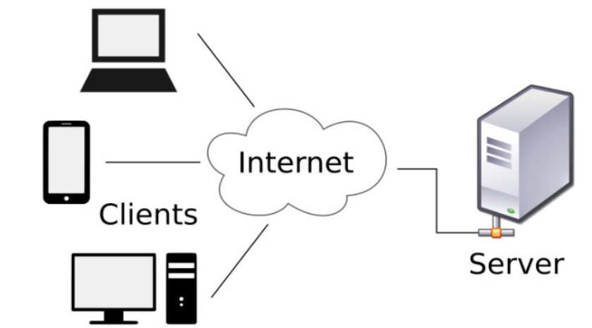
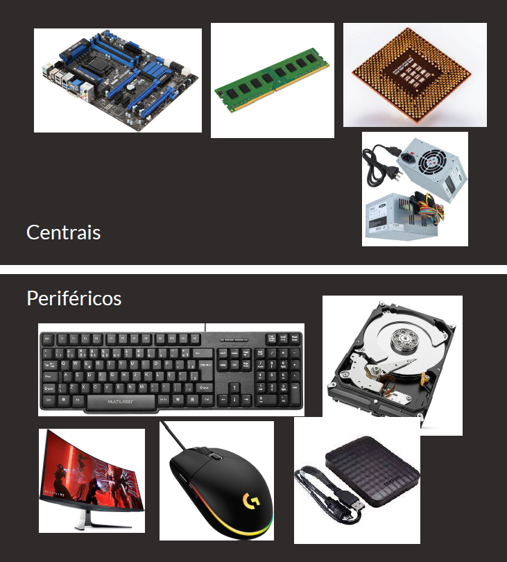

# Modulo 1 - Introdução, Sistemas e Aplicações

## Tópico 1 - Introdução à programação

### O que é programar?

- Um programa de computador é um produto que resulta da `atividade intelectual` de um programador. 
- Essa atividade depende de um treinamento prévio em `abstração` e `modelagem de problemas` (sua formulação e caminhos para a resolução), bem como o uso da lógica na verificação das soluções. 
- Esta atividade intelectual é traduzida em `instruções` para o computador, por meio de alguma linguage, que o faz executar operações que resolvam algum problema proposto.

Portanto, se quisermos dedfinir rapidamente o que é programar podemos dizer que: 
~~~
Programar é dar isntruções para que os computadores façam o que você quer que eles façam.
~~~

### Mas como a gente modela e resolve problemas na vida real?

- A atividade de programar consiste tanto na capacidade de `estruturar e resolver problemas` quanto na tradução dessa solução em `algoritmos` para a `codificação` em si.

### Para Assimilar:

~~~
Um algoritmos representa um conjunto de regras para a solução de um problema
~~~

### Mas como passamos essas instruções para o computador?

- Sabemos que progamar é dar instruções ao computador para ele fazer o que a gente quer que ele faça.
- Sabemos também que um algoritmo é uma forma de organizar em um conjunto de passos as operações para resolver um problema.

#### Resposta rápida: Por meio de uma `linguagem de programação`:

- As linguagens de programação são um método padronizado, formado por um conjunto de regras sintáticas e semânticas, que pode ser compilado ou interpretado e transformado em um programa de computador.

 

### O que é programar?

- Programar é dar `instruções` por meio de uma `linguagem de programação` para que os computadores executem a nossa `resolução de um problema`.

 

### Como Funciona a web?

- A internet é uma rede que interconecta computadores e outras redes de computadores e é composta por bilhões de dispositivos como servidores, roteadores, computadores e dispositivos móveis.
- Vários serviços funcionam sobre a infraestrutura da Internet como a telefonia (voz sobre IP) e World Wide Web.
- A World Wide Web é uma aplicação onde documentos e/ou páginas são interligadas através de links. É através dela que, por meio de um navegador e através de URLs, acessamos os sites e aplicações web.
- Os componentes básicos da Web são `clientes e servidores`.

 

#### Clientes 

- São os aparelhos que se conectam à Internet que `acessam` as páginas Web (por exemplo, seu smartphone conectado ao seu WI-FI).
- Geralmente as páginas Web são acessadas peloas navegadores Web (Chrome, Firefox, Brave, etc.) instalados nesses dispositivos.

 

#### Servidores

- São computadores que `armazenam` os arquivos que compõem os sites (por exemplo, documentos HTML, imagens, folhas de estilo, e arquivos JavaScript) e disponibilizam esses arquivos/páginas/sites para serem acessados pelos dispositivos clientes.
- Para isso, o servidor deve estar conectado a Internet, e assim, poderá ser acessado através do seu `endereço IP ou nome de domínio` (por exemplo, [startese](www.startse.com) ).

 

#### Mas como se comunicam?

- A comunicação entre dois ou mais dispositivos na Internet é realizada por meio endereços  conhecido como endereço IP) que identificam os dispositivos na rede e portas que fornecem pontos  e conexão para aplicações e serviços específicos.
- De forma resumida, para que um dispositivo A possa se comunicar com um dispositivo B, o  ispositivo A precisa saber o endereço IP de B e saber qual a porta de B está disponível para ele (oferece o serviço que ele espera).

Quando acessamos um determinado site a partir do nosso computador, informamos para o navegador o  ndereço do site, também conhecido como `URL` (Uniform Resource Locator). E o navegador se encarrega  e descobrir qual o endereço do servidor que armazena o site.

> URL é o endereço de um determinado recurso exclusivo na Web. Esse recurso pode ser uma página HTML, um documento CSS, uma imagem, um arquivo PDF, etc.

 

 

#### `PROTOCOLO` (obrigatório) : 

- Informa ao navegador qual o protocolo de comunicação, pode ser `http` ou `https`. 
- Quando não digitamos na barra de endereço o próprio navegador preenche.

#### `SUBDOMÍNIO` (opcional) : 

- Serve como uma extensão do nome de domínio, geralmente utilizado para disponibilizar diferentes sites/sistemas no mesmo domínio.

#### `DOMÍNIO` (obrigatório) : 

- É basicamente o nome (identificador) do site.
- DEVE ser informado pelo usuário na barra de endereços do navegador.

#### `PORTA` (opcional) : 

- Identifica a porta em que o site está disponivel no servidor, quando não é informada o navegador preenche internamente com a porta padrão de acordo com o protocolo utilizado (80 para http e 443 para https)

#### `RECURSO(path)` (obrigatório) : 

- Identifica qual o rescurso o navegador vai buscar no servidor, quando não é informado pelo usuário o próprio navegador preenche com uma "/", que significa página inicial do site.

#### `QUERY E PARÂMETROS` (opcional) : 

- Utilizado para enviar dados no formato de chave e valor pela URL.
- No exemplo o id é a chave e 12345 é o valor.

#### `ÂNCORA` (opcional) : 

- Utilizado para exibir partes especificas da página.

 

## Tópico 2 - Hardware

### O que é hardware?

- O hardware é a parte física do computador.
- O termo hardware é usado para fazer referência a detalhes específicos de cada equipamento incluindo informações detalhadas sobre seus `componentes`, seu `funcionamento`, suas `restrições` e `potencialidades`. 
- Importante lembrar que hardware não é um termo que se aplica exclusivamente a computação, apesar de ser amplamente utilizado neste cenário. Não é errado dizer, por exemplo: “Levarei o  ardware de minha TV para consertar”, isso significa que o equipamento físico está com algum  efeito que precisa de conserto.

Considerando hardware como dispositivos físicos no cenário da computação, ou seja, que auxiliam  a necessidade de calcular, podemos voltar mais ainda no tempo. A Humanidade tem utilizado dispositivos para auxiliar a computação há milênios. Pode se considerar que o ábaco, utilizado  ara fazer cálculos, tenha sido um dos primeiros hardwares usados pela humanidade. A partir do  éculo XVII, surgem as primeiras calculadoras mecânicas. 

 

Mas, bom, voltando ao presente, podemos pensar o hardware em duas categorias: `centrais` e `periféricos`.

 

### Para Assimilar:

- Os hardwares `centrais` são aqueles vitais para o funcionamento do computador, conectados diretamente à placa-mãe: a própria placa-mãe, o processador, a memória RAM e a finte de alimentação. Tudo o mais são `periféricos`.
- Importante atentar que dispositivos de armazenamento, como o HD, sçao periféricos.

 

### Tipos de Periféricos:
 

#### `De entrada` : Enviam informação para o computador: teclado, mouse, joystick, touchpad.
#### `De saída` : Transmitem informação do computador para o usuario: monitor, improessora, caixas de som.
#### `De processamento` : Processam a informação que a máquina (unidade central de processamento) enviou. Por exemplo: places de video e de som.
#### `De entrada e saída (ou mistos)` : Enviam e recebem informação do computador: monitor touch, drive gravador de CD e DVD, modem.
#### `De armazenamento` : Armazenam informações do computador e permitem sua recuperação futura: pen drive, disco rígido, cartão de memória, etc.
#### `Externos` : Equipamentos que são adicionados a um periférico: equipamentos a parte que fornecem e/ou encaminham dados.

 

## Tópico 3 - Software

 

### O que é software?

- O software é a parte intangível do computador, ou seja, a parte lógica. Um programa de  computador ou software é composto por uma sequência de instruções, que é interpretada e executada por um processador. 
- Em um programa correto e funcional, essa sequência segue padrões específicos  que resultam em um comportamento desejado.
- O termo software foi criado na década de 1940, e é um trocadilho com o termo hardware.
- Hardware, em inglês, significa ferramenta física. Software seria tudo o que faz o computador funcionar, através de instruções, excetuando-se a parte física dele.

#### Software é o que `dá vida` ao hardware:
Um hardware sem software é só um conjunto de circuitos elétricos com potencial, não executa nenhuma das coisas que atribuímos a um computador.

 

### Há vários tipos de software. Entre eles: `sistemas operacionais, drivers, linguagens de  rogramação, aplicativos e/ou utilitários`.
 

#### `Sistemas Operacionais` :
- Um sistema operacional é o software que inicializa o computador e que serve de meio de ligação entre o hardware e os demais programas.
- Fornece a plataforma que os aplicativos especializados precisam para operar e acessar o hardware.
- Toda vez que um aplicativo precisa exibir algo na tela, ele irá pedir ao sistema operacional que encaminhe seu material à saída de video.
- Toda vez que um aplicativo precisar salvar uma informação para recuperá-la posteriormente, ele irá pedir ao sistema operacional que ative o dispositivo de armazenamento (HD, pen drive, etc.).

 

#### `Drivers` :
- Para que dispositivos sejam reconhecidos pelo Sistema Operacional, eles dependem de uma interface que gerencie os dispositivos de entrada e saída, essa interface é o `driver`.
- Auxiliam o Sistema Operacional no gerenciamento, reconhecimento e melhor uso possivel do hardware.

 

#### `Linguagens de Programação` :
- Como fazemos software hoje em dia? Resposta: Com um software feito para isso.
- O processo de produção de um software exige basicamente dois elementos: uma linguagem de programação e um compilador (ou interpretador).
- A linguagem de programação é uma espécie de linguagem que se assemelha à linguagem humana, que o profissional da computação utiliza para expressar suas ideeias para que, em um segundo momento, um compilador ou interpretador às traduzem para uma linguagem que o computador consigar entender.

 

#### `Aplicativos e/ou utilitários` :
- Os aplicativos são certamente aqueles com os quais você teve maior contato.
- São todos aqueles que rodam em cima do sistema operacional, como: editores de texto, planilhas, jogos, navegadores, reprodutores de música e vídeo, etc.
- Podem ser livres para utilizar, como os `softwares livres` ou podem requerer a compra de sua licença, como os `software proprietários`.

 

### Para Assimilar:

~~~
Software é o que dá sentido ao hardware. É o que faz o hardware operar em função do usuário. Há vários tipos de software, cada um com uma função específica.
~~~

> Importante notar que todo software foi construído por pessoas através de uma linguagem de programação.

 

## Tópico 4 - Estrutura de um computador

 

- `Computação` significa o ato ou efeito de `computar`.
- Os computadores eletrônicos surgem da `necessidade de calcular` números e grandezas cada vez maiores.

O maior marco da computação que ditou a evolução do hardware até os dias de hoje foi a arquitetura proposta pelo matemático húngaro John von Neumann.

Ele propôs o conceito de `programa armazenado`, ou seja, a memória do computador armazenaria tanto as instruções a serem executadas quanto os dados a serem processados. Desta forma, as instruções poderiam ser facilmente modificdas sem a necessidade de alterar a ligação dos cabos com outros dispositivos.

Essa arquitetura dividia o computador em `Unidade central de processamento` (CPU - Central Process Unit), `Memória Principal` e `dispositivos de entrada e saída`.

Ficou conhecida como `arquitetura de Von Neumann`.

Os computadores eletrônicos são divididos em quatro gerações:

- 1ª Geração - Computadores a válvula e relé
- 2ª Geração - Computadores transistorizados
- 3ª Geração - Computadores com circuitos integrados
- 4ª Geração - Computadores com chips VLSI(Very Large Scale Integration)

 

Aqui temos uma esquematização da arquitetura de Von Neumann. Até os dias de hoje os computadores seguem essa arquitetura, a aperfeiçoando e aumentando a capacidade de processamento e memória.

 

### Processador ou CPU:

- A CPU é um microchip capaz de realizar boa parte da computação das informações.
- Sua velocidade é atribuída em função da velocidade do seu clock (relógio), que é medido em hertz (GHz).
- A frequência corresponde ao número de ciclos por segundo que o clock consegue executar.
- Quanto maior a frequência, maior a velocidade.

 

### Barramentos (bus):

- Os barramentos são os caminhos de dados impressas na placa mãe.
- São uma fiação que transmitem os dados de entrada ou de saída e entre os dispositivos da placa-mãe: entre a CPU e a memória, por exemplo.

 

### Memória:

- A memória é responsável por armazenar informações que o processador esta utilizando no momento, ou então, que irá utilizar futuramente.
- Temos dois tipos de memória:
  - Memória Principal.
  - Memória Secundária.

 

#### Memória Principal:

- A principal é a memória RAM (Random Access Memory).
- A cada vez que o computador é ligado, todos os "espaços" da memória são zerados e ela começa a ser novamente preenchida.
- A memória RAM é medida em bytes (especialmente gigabytes).
- Quanto maior a quantiadde de memória RAM disponível, maior é o número de programas ou atividades que poderão ser utilizados ao mesmo tempo, e quanto maior a frequência em `hertz` da troca desses dados, mais fluída a transição entre programas e execução das atividades.

 

#### Memória Secundária:

- A memória secundária é a responsável pelo armazenamento, são os HDs e SSDs.
- As informações armazenadas nestes dispositivos persistem.
- O HD (hard disk ou disco rígido) é um dispositivo eletromecânico que contém alguns discos magnetizados sobre os quais uma caeça de leitura e gravação consegue acessar os dados.
- O SSD (Solid State Drive ou Unidade de Estado Sólido) é uma alternativa eletrônica ao HD, ela armazena dados muito mais rápido que um HD convencional, funciona por meio de memória flash, que é como a RAM, mas não volátil, ela consegue manter as informações mesmo sem energia.

 

#### Periféricos de entrada:

- Os periféricos de entrada são em geral os dispositivos que nos permitem fornecer dados ao computador.
- É através deles que informamos o que precisamos que seja feito e com quais informações.
- Os periféricos de entrada mais conhecidos são o teclado e o mouse.

 

#### Periféricos de saída:

- Os periféricos de saída nos oferecem o resultado do processamento.
- É através deles que podemos visualizar nossa interação com o computador.
- Os mais comuns são os monitores e as impressoras.

 

## Tópico 5 - Internet

 

### Como surgiu a internet?

 

- A ideia de algo como internet surge em contextos militares na década de 60, havia um grande temor em relação a possíveis ataques nucleares. 
- Pesquisas buscavam desenvolver uma cadeia de comunicações onde não existisse um ponto central que, ao ser destruído, colocaria em colapso todo o sistema de comunicações.
- Em meados de 1962, os Estados Unidos criaram a Cadeia de Comunicação Distribuída (CCD), que era composta por vários computadores interligados por várias linhas telefônicas diferentes, que objetivava-se dividir o volume de dados a ser trafegado entre os computadores em pequenos “pacotes”, despachando-os por meio das diferentes linhas telefônicas até um computador de destino. 

 

Neste modelo, na eventual falha de um dos `pacotes` por meio de um dos `caminhos`, o sistema poderia utilizar um caminho equivalente, ou seja, não há um ponto único de falha. Uma eventual interrupção em alguma linha de transmissão `não interrompe completamente o sistema`.

A ancestral da internet foi a `ARPANET`. Foi a primeira `rede de computadores` por comutação de pacotes. Em 1966 a ARPANET estava instalada em 17 locais diferentes nos quais computadores conectados às linhas telefônicas conseguiam trocar informações. Em um primeiro momento, sua utilização foi exclusivamente militar.

 

### Mas como isso virou a `internet` que conhecemos hoje?

- Com constantes otimizações e incorporações de novas tecnologias à ARPANET, como o desenvolvimento do `protocolo de rede, Transmission Control Protocol/Internet Protocol (TCP/IP)` em 1982 e que, depois, foi liberado para utilização civil, até hoje, tem se mostrado uma das melhores alternativas para comunicação entre computadores.
- Com a adoção de um protocolo único e padronizado, tornou-se viável conectar computadores de diferentes fabricantes em redes com diferentes meios de distribuição.

 

### Protocolo de rede:

- Um protocolo de rede é um conjunto de regras que definem a forma como dois sistemas se comunicam.
- É uma espécie de língua falada entre os dispositivos.
- Se ambos 'falam' o mesmo protocolo então a comunicação pode ser estabelecida.

 

#### Como se dá o acesso à Internet:

- Por meio de uma Internet Service Provider (ISP) ou Provedor de Serviço de Internet e utiliza-se de, pelo menos, três componentes (CPE, rede de acesso e POP)
- Customer Premise Equipment (CPE) é o equipamento que conectar o dispositivo à rede de acesso (exemplo: modem).
- Rede de acesso é o tipo de infraestrutura que liga o dispositivo ao provedor de internet (exemplos: cabos de cobre, fibra ótica, WI-FI).
- Point of Presence (POP) é o ponto de presença do provedor onde estão os equipamentos que atribuem ao dispositivo um endereço IP, dando-lhe acesso à internet.

 

### Endereço IP e MAC Address:

- Para que um computador possa se conectar a internet e se comunicar com outros computadores, faz-se necessário que este recea um número de identificação - esse número é conhecido como endereço Internet Protocol (IP).
- Para entender a importância de um endereço IP, podemos fazer uma analogia com o sistema de telefonia: para que duas pessoas conversem entre si, ambas precisam se um número telefônico (origem e destino).
- O mesmo se aplica aos computadores conectados à internet: cada um, no momento em que se conecta a um provedor de acesso, recebe um número (número IP), a partir do qual pode realizar 'chamada" (conexões) com outros computadores que também estejam conectados à internet.
- Mas como o provedor de acesso sabe se são aparelhos diferentes conectando à internet?
  - Pelo MAC Address! O endereço MAC é um número único de cada máquina, que eprmite distinguir e identificar um aparelho específico.
  - Permitindo bloquear ou garantir aceso de um aparelho específico à redes privadas por exemplo.
- Um endereço de internet, IP na versão 4, é um número escrito em quatro partes (octetos), cada uma variando de 0 a 255 – por exemplo: 200.132.39.115.
- É importante ressaltar que um endereço IP não identifica necessariamente, um equipamento individual, mas sim uma conexão.
- Podemos encontrar equipamentos (gateways) conectados a várias redes que possuem mais de um endereço IP (um para cada conexão).
- O endereço MAC é formado por um conjunto de 6 bytes separados por dois pontos (“:”) ou hífen (“-”), sendo cada byte representado por 
dois algarismos na forma hexadecimal, como por exemplo: "00:19:B9:FB:E2:58".

### Outros Conceitos Importantes: `DNS` E `HTTP`:

 

#### `DNS`:

- Para facilitar a memorização dos endereços, foi implementado um sistema de nomes de domínio - DOmain Name System (DNS) - através do qual é possivel traduzir um endereço, como www.mec.gov.br, em um endereço que nos remete até a rede desejada - nesse caso, a do Ministério da Educação (MEC).
- O DNS é um sistema hierárquico que passou a ser utilizado em 1984, fundamentado em uma base de dados distribuída hierarquicamente na qual os equipamentos realizam consultas para descobrir o endereço IP dos computadores que precisam ser conectar.

 

#### `HTTP`:

- É o protocolo que nos permite navegar entre páginas na internet.
- HTTP significa `Hypertext Transfer Protocal` ou Protocolo de Transferência de Hipertexto.
- O formato do texto criado para ser transportado pelo protocolo foi chamado de HTML (HyperText Markup Language) e conssite de uma linguagem de marcação pela qual é possível, por meio de comandos (tags), incluir ligações entre textos - inclusive entre materiais publicados em diferentes locais.
- Foi criado no meio dos anos 90 por Tim Berners-Lee, um cientista de CERN, para ajudar a organizar os textos e pesquisas de seus companheiros de CERN.
- Além de um protocolo (conjuto de regras para que dois dispositivos 'conversem') e de uma linguagem de marcação (para permitir que os usuários se expressem), era necessário um software que, utilizando-se do protoclo desenvolvido, conseguisse obter os documentos escritos em HTML, interpretá-los e exibi-los.
- Por meio deste software,esperava-se que o usuário 'navegasse' pelo hipertexto, ou seja, ao encontrar no texto uma ligação com outro material, com um simples clique, o usuário seria direcionado para uma nova página/conteúdo.
- Diante de tal necessidade, Tim Berners-Lee criou um protótipo daquele que viria a ser um dos software mais indispensáveis para quem deseja utilizar a internet: o navegador (ou browser).

 

## Tópico 6 - Sistemas Operacionais

 

### O que é um Sistema Operacional?
 

- É um `software` que fornece uma `interface` entre o hardware do computador e você, o usuário do computador.
- O sistema operacional normalmente é organizado como uma coleção de programas de computador que:
  - Inicializam o hardware.
  - Fornecem rotinas básicas para controle dos dispositivos (entrada, saída e armazenamento).
  - Gerenciam o escalonamento e a interação entre outros programas.
  - Mantém a integridade das informações armazenadas.

Existem diferentes tipos de sistemas operacionais, especializados em determinadas arquiteturas de hardware ou tipo de utilização (corporativo, pessoal, industrial, etc).

 

### Quais são as partes que compõem um `Sistema Operacional` ?

 

#### `Kernel (núcleo)` :

- É o coração de um S.O., é onde ficam suas funções executivas, isto é, todas instruções de como comunicar com o hardware e como gerenciá-lo. 
- É a parte mais valorosa de um S.O., é o elo do hardware com o software.
- Seu principal objetivo é gerenciar o computador e permitir que os aplicativos sejam executados e façam uso dos recursos que a máquina tem.
- O núcleo também tem que garantir, por exemplo, que a memória RAM seja usada em seu potencial sem risco para o computador.

 

#### `Gerenciador de Processos` :

- Controla o uso que os programas fazem do computador, estabelecendo políticas para que essa utilização seja a mais justa possivel.

 

#### `Escalonador (scheduler)` :

- Escalonamento de processos é o ato de realizar o chaveamento dos processos ativos, de acordo com regras bem estabelecidas, de forma que todos os processos tenham chance de utilizar a CPU. 
- O escalonador é a parte do SO encarregada de decidir entre os processos prontos, qual será colocado na execução.
- Existem várias formas de escalonamento, cada uma seguem diferentes critérios de justiça (cada processo obter sua parte justa do tempo da CPU), eficiência (garantir ocupação de 100% do tempo da CPU), minimizar o tempo de resposta a comandos de usuários interativos, maximizar o número de serviços processados por hora, etc.

 

#### `Gerenciador de arquivos` :

- É a função que organiza, edita e predispõe as regras para o armazenamento de acordo com o sistema de arquivos.

 

#### `Interface` :

- É a parte pensada para o `input` do usuário.
- Podemos vê-la de várias formas: Um terminal para comandos como o MS-DOS, uma interface gráfica como o Windows ou MacOS, uma tela com textos e interação via botões como os aparelhos mp3, etc.
- Em interfaces gráficas podemos também ter várias formas de `input`.

A `interface` de um sistema operacional pode nos ser apresentada de diferentes formas, uma delas é conhecida como `prompt de comando` ou `terminal`. Um prompt de comando é na verdade uma jabela através da qual o usuário dispara comandos que acionam ações do sistema operacional. Este tipo de interface é normalmente utilizada por usuários avançados, uma vez que oferece um nível mais elevado de complexidade para sua utilização.

 

Outra forma que a `interface` do sistema operacional nos é apresentada é por meio de uma área de trabalho com ícones e janelas gráficas. Essa certamente é a forma em que estamos mais acostumados a ter contato com o sistema operacional. Ícones são pequenas imagens utilizadas para simbolizar ações ou programas. Sua ação está normalmente associada ao uso do `mouse`, que ao clicar sobre o ìcone dispararia alguma ação.

 

As `janelas` são um recurso gráfico muito importante da interface de um sistema operacional moderno. Uma janela é uma área geralmente retangular composta por uma barra de título com alguns botões de controle que atuam sobre a própria janela. Os botões de controle podem minimizar a janela (ocultando-a temporariamente), maximizá-la (fazendo com que a mesma ocupe todo o tamanho da área de trabalho) ou restaurá-la (de forma que retorne ao seu tamanho original). As janelas são normalmente delimitadas por bordas, que se clicadas e movimentadas, permitem que a mesma seja redimensionada. Para mover uma janela utiliza-se clicar sobre sua barra de título arrastando-a até sua nova posição.

 

### Quais são os tipos de `Sistemas Operacionais`?

 

#### `DESKTOP` :

- São os tipos que vemos em computadores de mesa e/ou laptops.
- São os primeiros a ser desenvolvidos, e os mais notáveis são o Windows, MacOS e as milhares de distribuições do Linux.
- São pensados para funções do dia a dia e ambiente de trabalho, como cálculos matemáticos, navegação na Web, edição de texto, vídeo ou áudio, execução de músicas e vídeos, etc.
- São fetios geralmente para a arquitetura CISC (Complex Instruction Set Computer) de processadores, com exceção do novo MacOS, que transicionou para o modelo ARM (RISC - Reduced Instruction Set Computer).

 

#### `SERVER` :

- São S.Os focados em estabilidade, gestão de uma grande quantidade de arquivos e armazenamento e segurança, são utilizados para esta do lado do servidor.
- Neste mundo `server-side` , a grande maioria das máquinas usa alguma distro Linux derivada de Red Hat, como o próprios Red Hat, mantido pela Oracle, ou o Fedora, por exemplo.
- Há também o Windows Server, também bastante utilizado pela familiaridade do público em geral com o sistema.
- É um Windows sem figuras e focado nas funções necessárias para um Servidor.

 

### `MOBILE` :

- São S.Os dedicados à aparelhos mobile, como smartphones e tablets.
- Caracterizam-se por otimizar na arquitetura ARM de processadores e por serem desenhados para a experiência ótima por telas de toque.
- O mercado global é dominado pelo sistema Android, que é Linux (open source), e suas variações, mas tem um npumero expressivo do sistema IOS.
- E um que vale mencionar, é o descontinuado Windows Phone. Foi a tentativa da Microsoft de entrar no mundo dos S.Os Mobile que não vingou.

 

#### `EMBUTIDO (Embedded)` :

- São pensados para `hardwares`com pouca capacidade de processamento e têm uma função muito específica, como por exemplo, o S.o> dos primeiros celulares com multimídia, calculadoras, tocadores de MP3, relógios inteligentes, caixas eletrônicos, copiadoras, etc.

 

### Mais quais são as principais `funções` de um `sistema operacional?` :

 

Há basicamente `três funções` que todo o sistema operacional precisa nos fornecer:
- `Gerenciamento de processos` (ou programas).
- `Gerenciamento de Arquivos` .
- `Gerenciamento de Memória` .

 

#### `Gerenciamento de processos` :

- A primeira função consiste em permitir a execução de outros softwares, gerenciar o seu ciclo de vida e o compartilhamento de recursos pelos mesmos.
- `Isso significa que é função do sistema operacional controlar o uso que os demais programas fazem do computador`, estabelecendo políticas para que essa utilização seja a mais justa possível.

Imagine um cenário onde um usuário está acessando uma página para fazer uma pesquisa, ouvindo música e conversando com um amigo pela internet. Neste caso, temos pelo menos três aplicações utilizando o hardware quase que simultaneamente. O gerenciamento de processos do sistema operacional é responsável
por permitir que cada aplicação utilize os recursos de hardware, especialmente o processador, um pouco de cada vez, de forma transparente, ou seja, sem que o usuário perceba este compartilhamento.
Os sistemas operacionais geralmente nos oferecem opções para visualizar e monitorar o conjunto de tarefas que estão sendo executadas.

 

#### `Gerenciamento de Arquivos` :

- A segunda função do sistema operacional é o gerenciamento de arquivos.
- Essa sem dúvida é a funcionalidade que, enquanto enquanto usuário, mais teremos contato.
- Um arquivo é um conjunto de dados que podem ser reconhecidos por uma aplicação.
- As informações armazenadas por um computador em um dispositivo de armazenamento (SSD, HD, pen drive, DVD, etc) estão contidas em arquivos.
- Os arquivos possuem atributos, como por exemplo, um nome, uma data e hora de alteração, tamanho e tipo.
- Alguns caracteres não são permitidos para compor o nome de arquivos.
- O tipo de uma arquivo identifica para o sistema operacional o conteúdo do mesmo.
- Normalmente o tipo de um arquivo é identificado por meio de um extensão (uma pequena sigla disposta após o nome do arquivo e separada por um "." - ponto).
- Quando descarregamos as fotos e vídeos de nosso smartphone para o computador, cada foto e vídeo é um arquivo.
- Quando escrevemos um trabalho escolar ou um relatório profissional estamos produzindo arquivos.
- Quando escutamos música em formato digital estamos acessando, para cada música, um arquivo.

 

- Os sitemas operacionais nos oferecem gerenciadores de arquivos, ou seja, aplicações que permitem organizar da maneira mais adequada os arquivos existentes nos diposiitivos de armazenamento.
- Neste sentido, é importante que conheçamos o conceito de diretório ou pasta.
- Uma pasta (também conhecida por diretório) é uma estrutura utilizada para agrupar e organizar arquivos.
- Seria o mesmo que fazer a seguinte analogia com um escritório: pastas são gavetas ou envelopes e arquivos são os documentos contidos nas gavetas ou envelopes.
- Nunca vamos encontrar um arquivo com uma pasta dentro, ou seja, as pastas guardam arquivos, mas o contrário não.

 

- O sistema de arquivos de um sistema operacional geralmente inicia-se a partir de um `diretório raiz` e a parte dele para organizar os subdiretórios.
- No caso do Windows, o diretório raiz de um dispositivo de armazenamento é conhecido por unidade e é representado por uma letra seguida pelo sinal de dois pontos ":".
- Por convenção, um disco rígido (HD ou SSD) é normalmente a unidade "C:", já um pen drive, por se tratar de um dispositivo removível, poderá se utilizar de qualquer letra.
- Para os antigos drives de disquete o WIndows reserva as letras "A:" e "B:".
- Partindo-se da letra da unidade e o conjunto de subdiretórios hierarquicamente inferiores conseguimos chegar até o local onde o arquivo está armazenado.

 

##### Quais `Operações` posso fazer com arquivos em um sistema operacional?

 

Podemos : `Criar uma cópia`, `mover`, `excluir`, `restaurar`, `compactar`, `criar uma atalho`, `localizar`, `renomear`.

 

#### `Gerenciamento de Memória` :

- O sistema operacional aloca e gerencia um espaço da memória principal para cada apicativo poder utiliza-la.
- Da mesma forma, ele também protege tais áreas de forma que aplicativos não "invadam" o espaço de memória uns dos outros.
- Na medida em que um aplicativo necessita de mais memória, ele solicita ao sistema operacional que irá verificar a disponibilidade e lhe permitir o acesso.
- Um recurso muito importante e útil dessa função é a área de transferência.
- A área de transferencia se constitui como uma região de memória gerenciada pelo sistema operacional na qual os aplicativos podem livremente "copiar" dados.
- Os dados da área de transferência podem ser descarregados no próprio aplicativo ou em outro (uma vez que a área de transferência é um recurso compartilhado).

As três principais funções da área de transferência são justamente:
- Copiar
- Colar
- Recortar

 

## Tópico 7 - Tipos de aplicação Web

 

### O que é uma `webpage`?

 

- Uma webpage é um documento individual que pode ser visualizado online.
- Ela pode ser uma página repleta de textos, imagens ou vídeos.
- Uma `webpage` pode ser uma formulário simples até mesmo aparentar estar vazia, abrigando códigos que você sequer pode notar.
- Cada `webpage` contém uma URL específica que direciona os usuários até ela.
- Um `website`, por sua vez, é uma coleção de `webpages`.
- Se `webpages` sãp páginas, o site é como se fosse o livro todo.

O elemento principal de uma página web é um ou mais arquivos de texto escritos na linguagem HTML (Hypertext Markup Language).

Muitas páginas web também usam código JavaScript para compotamento dinâmico e código CSS (Cascading Style Sheets) para semântica de apresentação. Imagens, vídeos e outros arquivos multimídia também são frequentemente incorporados em páginas web.

 

### Qual é a diferença entre um site `Estático` e `Dinâmico`?

 

#### `Site Estático` :

- É aquele que `não` conta com ferramentas de gerenciamento para alterações, mudanças ou reformulações realmente significativas de conteúdo, sem alteração do código fonte.
- Isso significa que, caso você deseje realizar esse tipo de modificação em um `website estático`, precisará de um profissional que tenha conhecimento de linguagens como CSS, JavaScript, PHP ou HTML.

 

#### `Site Dinâmico` :

- Permite que sejam realizadas constantes `alterações` de conteúdo, como a criação de páginas, mas sem a necessidade de alteração no código fonte por parte de um profissional da área.
- Também chamado de `site gerenciável`, o site dinâmico conta com um sistema de gerenciamento integrado, possibilitando a realização de alterações por meio de um `CMS` (Content Management System), como o WordPress.

 

### O que é uma `aplicação web` ?

 

#### `Aplicação Web` :

- A aplicação web diz respeito a uma solução que é executada diretamente no navegador, não sendo preciso realizar uma instalação na máquina do usuário.
- Pode-se, também, utilizar como definição: `tudo aquilo que é processado em um servidor terceiro.`
- As plataformas de e-commerce, os apps do google como o `docs` e o `meets`, e as redes sociais são alguns dos exemplos de aplicações web.

 

### Como se desenvolve `aplicações Web` ?

 

#### `Front-end` :

- `Front-end`significa "parte dianteira", ou seja, a porta de frente de uma aplicação web.
- É a parte responsável por "dar vida" à interface.
- Podemos definir `front-end` como a parte visual de um site, desenvolve o código que será renderizada nos aspectos visuais e interativos de uma página.
- HTML, CSS, JavaScript (React, Angular), Dart (Flutter), Swift e XML são exemplos de linguagens utilizadas para a construção visual de páginas e aplicativos.
- Um código simples de front-end se parece com isso (foto abaixo). Esta é uma página HTML, observe as tags de abertura e fechamento que denotam que elemento da página que está sendo criado.

 

##### `Body` : corpo
##### `div` : divisão
##### `h1` : header 1/ título, cabeçalho
##### `ol` : ordered list/ lista ordenada
##### `li` : list item/ item de lista

 

#### `Back-end` :

- `Back-end, ou 'parte traseira' é a parte de "trás" de uma aplicação Web.
- Ela é a responsável, em termos gerais, pela implementação da `regra de negócio`.
- Ela é o "motor" de uma aplicação web: ela que verifica, por exemplo, se a senha bate com o usuário e efetua o login em um site.
- Também é no back-end que se faz a comunicação com o banco de dados, para buscar ou armazenar informações, etc.
- Quando falamos de back-end em desenvolvimento web, nos deparamos com várias linguagens, como Go, Clojure, C#, PHP, Java, Python, Ruby, entre outras.
- Um códgio simples de back-end se parece com isso (foto abaixo). Este é um módulo em TypeScript, que define o que será feito se algo for postado em '/current';

 

- Parece ser uma aplicação web de algum jogo, em que no endpoint da API '/current' temos o jogador selecionado.
- O método está definindo a ação dee trocar o jogador selecionado.
- Assim, ela recebe como par^metros da resuisição o identificador do jogador, o seu ID.
- Com ele, ele verifica se há um jogador com esse ID.
- Se não há o ID, ele imprime no console que não há jogador com tal ID.
- Havendo o ID, ele faz a troca do jogador selecionaado e retorna o novo jogador. Se houver algum tipo de erro, ele captura o erro e imprime no console.

 

### Como `Front-end` e `Back-end` se `comunicam` ?

 

#### `APIs` :

- Uma `API` (Application Programming Interface) pode ser definida como um conjuton de padrões que permite a construção de aplicativos, onde ele conecta aplicações, podendo ser utilizada nos mais variados tipos de negócios.
- Com a API você tem uma interface para que um sistema se comunique com outro sistema, compartilhando suas ações e ferramentas.
- A comunicação é feita através de vários códigos, definindo comportamentos especifícos.

 

##### `API Endpoints` :
- Um endpoint contêm três principais caracteristicas:
  - `Address` : Onde o serviço esta hospedado.
  - `Binding` : Como o serviço pode ser acessado.
  - `Contract` : O que tem no serviço.

 

##### `JSON` :

- O formato JSON (javaScript Object Notation) é, como o nome sugere, uma forma de notação de objetos JavaScript de modo que eles possam ser representados de uma forma comum a diversas linguagens.
- Além disso, uma ideia que está fortemente enraizada neste formato é que ele seja facilmente trafegado entre aplicações em quaisquer protocolos, inclusive o HTTP.
- Portanto, a principal diferença entre um objeto JavaScript padrão e um JSON é o fato do JSON ser na realidade: um texto.

 

##### `Integração` :

- A integrtação é como se comumente chama o ato de conectar o `Back-end` ao `Front-end`.
- Geralmente, o Back-end é estruturado em uma API, em que cada endpoint expõe um serviço necessário para a aplicação.
- O front-end consome dessa API as informações que serão exibidas na página.
- Para isso, ela faz a requisição (passando parâmetros ou não) em um dos endpoints.
- As informações vêm em formato JSON.
- A partir disso, o front consegue mapear os dados e exibi-los na tela.

 

### Qual a diferença entre `aplicações Web` tradicionais e `SPAs`?

 

#### `Aplicações SPAs` :

- `SPA` significa `Single Page Application`, ou Aplicação de Página Única.
- Mas não é um site de uma só página como o nome sugere.
- É, na verdade, uma forma de site com múltiplas páginas que carrega apenas uma vez.
- Em vez de um carregamento por página (uma requisição por página), como é uma aplicação Web convencinal, um SPA carrega toda a aplicação apenas uma vez, demorando mais no início, mas tendo mais fluidez na troca de páginas.

 

## Tópico 8 - Principais funções de um sistema operacional (aula)

 

## Tópico 9 - Tipos de aplicação Web (aula)

 

## Tópico 10 - Front-end e Back-end (aula)

 

## Tópico 11 - Extras - Entendendo o mercado de computadores

 

### Qual é o `cenário` das `especificaçõesdos` computadores hoje? Como escolher um bom computador?

- A maior parte dos computadores comercializados contém processadores dessas duas famílias e marcas: AMD Ryzen e Intel Core.
- Ambos são processadores de qualidade e com recursos modernos para as tarefas que mais usamos hoje.
- Os AMD Ryzen custam menos e oferecem mais poder bruto por núcleo, enquanto os Intel custam mais e oferecem mais eficiência multi-núcleo.

 

~~~
Há também os Apple Silicon, que mudaram a arquitetura dos laptops e desktops e entregam muita mais potência e eficiência que os mencionados.
~~~

 

~~~
Outro aspecto importante é a quantidade de RAM. Para 2022, é muito difícil fazer um uso
contínuo e fluido de um computador sem ter
pelo menos 8GB de RAM.
~~~

 

- O armazenamento também passou por uma revolução nos últimos anos. Encontramos no mercado opções com SSD e com HD.
- A diferença é no tamanho de armazenamento, na velocidade e no preço;
- SSDs são mais caros que HDs e oferecem menos armazenamento no geral. Dois PCs do mesmo modelo com o mesmo preço, oferece HD de 1TB vs. SSD de 128GB.
- A diferença de armazenamento é gigante, mas de desempenho também o SSD é até 10 vezes mais rápido que um HD top de linha.

 

- Outro ponto importante a se observar é a qualidade de construção.
- Com isso, a gente verifica a durabilidade de um modelo, sua facilidade de manutenção e conforto no uso.
- Há muitos modelos com boas especificações mas pessimamente construído, coisa que atrapalha as qualidades do modelo e o faz ser pior que um modelo mais bem construído com menos potência.

 

### Quais são as `especificações ideais` para um `desenvolvedor`?

1) Processador igual ou acima dos Intel Core i5 ou AMD Ryzen 5 das últimas 3 gerações: Intel começados em 8, E Ryzen começados em 3. 
   - Exemplos: Processador Intel® Core™ i5-8365U, Processador AMD Ryzen 5 3600
2) Acima de 8GB de memória RAM.
3) Preferência por SSD, ou upgrade para SSD futuramente.

 

## Tópico 12 - Engenharia de Software e boas práticas

 

### Como funciona o desenvolvimento de software?

 

#### Software é `desenvolvido ou passa por um processo de engenharia`; ele não é fabricado no sentido clássico.
- Embora existam algumas similaridades entre o desenvolvimento de software e a fabricação de hardware, as duas
atividades são fundamentalmente diferentes.
- Ambas requerem a construção de um “produto”, entretanto, as abordagens são diferentes.
- Os custos de software concentram-se no processo de engenharia.
- Isso significa que projetos de software não podem ser geridos como se fossem projetos de fabricação.

 

#### Software não se `desgasta`, ele se `deteriora`.
- Software não é suscetível aos males ambientais que fazem com que o hardware se desgaste.
- Portanto, teoricamente, a curva da taxa de defeitos para software deveria assumir a forma da “curva idealizada”.
- Defeitos ainda não descobertos irão resultar em altas taxas logo no início da vida de um programa.
- Entretanto, esses serão corrigidos e a curva se achata como mostrado.
- curva idealizada é uma simplificação grosseira de modelos de defeitos reais para software.
- Porém, a implicação é clara: software não se desgasta, mas sim se deteriora!

 

#### Quais são os desafios no `desenvolvimento de software?`
- Devemos fazer um `esforço concentrado para compreender o problema antes de desenvolver uma solução de software`;
- Dado o aumento da complexidade do software em todos âmbitos, `estar constantemente atualizado` e a par das novas tecnologias é fundamental. Pelo mesmo motivo, `projetar tornou-se uma atividade-chave`;
- Em um mundo cada vez mais dependente de software, `um software deve apresentar qualidade elevada`;
- À medida que sua base de usuários e seu tempo em uso forem aumentando, a demanda por adaptação e perfeiçoamento também irá aumentar. Portanto, um `software deve ser passível de manutenção`.

> Dessa forma, software, em todas as suas formas e em todos os seus campos de aplicação, deve passar pelos `processos de engenharia`.

 

### O que é `engenharia de software?`

- `Engenharia de software` é a aplicação de uma abordagem sistemática, disciplinada e quantificável no desenvolvimento, na operação e na manutenção de software; isto é, a `aplicação` de `engenharia ao software`. Bem como o estudo de abordagens.
- A engenharia de software é uma tecnologia em camadas.
- A pedra fundamental que sustenta a engenharia de software é o foco na qualidade.
- A base para a engenharia de software é a camada de processos.

#### `Processo` :
- O processo de engenharia de software é a liga que mantém as camadas de tecnologia coesas e possibilita o
desenvolvimento de software de forma racional e dentro do prazo.
- O processo define uma metodologia que deve ser estabelecida para a entrega efetiva de tecnologia de engenharia de software.

 

#### `Métodos` :
- Os métodos da engenharia de software fornecem as informações técnicas para desenvolver software: comunicação, análise de requisitos, modelagem de projeto, construção de programa, testes e suporte.

 

#### `Ferramentas` :
- As ferramentas da engenharia de software fornecem suporte automatizado ou semi-automatizado para o processo e para os métodos.

 

### E o que é o `processo de software?`

 

As cinco atividades genéricas do processo de software:
1) `Comunicação`: levantamento das necessidades que ajudarão a definir as funções e características do software.
2) `Planejamento`: define o trabalho de engenharia de software, descrevendo as tarefas técnicas a ser conduzidas, os riscos prováveis, os recursos que serão necessários, os produtos resultantes a ser produzidos e um cronograma de trabalho.
3) `Modelagem`: Cria-se um “esboço” da coisa, de modo que se possa ter uma ideia do todo — qual será o seu aspecto em termos de arquitetura, como as partes constituintes se encaixarão e várias outras características.
4) `Construção`: Essa atividade combina geração de código e testes necessários para revelar erros na codificação.
5) `Emprego (Implantação)`: O software é entregue ao cliente, que avalia o produto entregue e fornece feedback, baseado na avaliação.

 

A essência da prática:

- Compreenda o problema;
- Planeje a solução;
- Execute/leve adiante o plano;
- Examine o resultado.

 

### Os `7 princípios` da engenharia de software
 

1) `A razão de existir!`
~~~
Um sistema de software existe por uma única razão: gerar valor a seus usuários. Todas as decisões deveriam ser tomadas tendo esse princípio em mente. Antes de especificar uma necessidade de um sistema, antes de indicar alguma parte da funcionalidade de um sistema, antes de determinar as plataformas de hardware ou os processos de desenvolvimento, pergunte a si mesmo: “Isso realmente agrega valor real ao sistema?”. Se a resposta for “não”, não o faça. Todos os demais princípios se apoiam neste primeiro.
~~~

2) `KISS (`K`eep `I`t `S`imple `S`tupid!)`
~~~
Esse princípio contribui para um sistema mais fácil de compreender e manter. Isso não significa que características, até mesmo as internas, devam ser descartadas em nome da simplicidade. De fato, frequentemente os projetos mais elegantes são os mais simples, o que não significa “rápido e malfeito” — na
realidade, simplificar exige muita análise e trabalho durante as iterações, sendo que o resultado será um software de fácil manutenção e menos propenso a erros.
~~~

3) `Mantenha a visão`
~~~
Uma visão clara é essencial para o sucesso. Sem ela, um projeto se torna ambíguo. Sem uma integridade conceitual, corre-se o risco de transformar o projeto numa colcha de retalhos de projetos incompatíveis, unidos por parafusos inadequados... Comprometer a visão arquitetônica de um sistema de software debilita e até poderá destruir sistemas bem projetados. Ter um arquiteto responsável e capaz de  manter a visão clara e  e reforçar a adequação ajuda a assegurar o êxito de um projeto.
~~~

4) `O que um produz os outros consomem`
~~~
Sempre especifique, projete e implemente ciente de que alguém mais terá de entender o que você está fazendo.  O público para qualquer produto de desenvolvimento de software é potencialmente grande. Especifique tendo em vista os usuários; projete, tendo em mente os implementadores; e codifique considerando aqueles que  terão de manter e estender o sistema. Alguém terá de depurar o código que você escreveu e isso o faz um  suário de  seu código; facilitando o trabalho de todas essas pessoas você agrega maior valor ao sistema.
~~~

5) `Esteja aberto para o futuro`
~~~
Nos ambientes computacionais de hoje, em que as especificações mudam de um instante para outro e as plataformas de hardware se tornam rapidamente obsoletas, a vida de um software, em geral, é medida em meses, mas precisamos de produtos mais duráveis que isso! Jamais faça projetos limitados, sempre pergunte “e se” e prepare-se para todas as possíveis respostas, criando sistemas que resolvam o problema geral, não apenas aquele específico. Isso muito provavelmente conduziria à reutilização de um sistema inteiro.
~~~

6) `Planeje com antecedência, visando a reutilização`
~~~
Planejar com antecedência para o reuso reduz o custo e aumenta o valor tanto dos componentes reutilizáveis quanto dos sistemas aos quais eles serão incorporados.
~~~

7) `Pense!`
~~~
Este último princípio é, provavelmente,aquele que é mais menosprezado. Pensar bem e de forma clara antes de
agir quase sempre produz melhores resultados. Quando se analisa alguma coisa, provavelmente esta sairá correta. Ganha-se também conhecimento de como fazer correto novamente. Se você realmente analisar algo e mesmo assim o fizer da forma errada, isso se tornará uma valiosa experiência. Um efeito colateral da análise é aprender a reconhecer quando não se sabe algo, e até que ponto poderá buscar o conhecimento.
~~~

 

### O que são `boas práticas?`

 

A ideia central por trás do conceito de boas práticas é: `não se faz código para máquinas, mas sim para pessoas!`

Boas práticas são toda ação no ambiente de desenvolvimento que corrobora para garantir os sete princípios que mencionamos: `que visam a durabilidade, facilidade de manutenção, clareza e compreensão do código, bem como a postura de documentar e compartilhar conhecimento sobre o projeto e tecnologias.`

 

 

## Tópico 13 - O que é engenharia de software?

 

## Tópico 14 - Os 7 princípios da engenharia de software

  

