# Modulo 2 - Linguagens de Programação

## Tópico 1 - Linguagens de Programação

 

### O que é Linguagem de Programação?

 

`Linguagem dede Programação` é um conjunto de comandos, instruções e regras utilizadas para criar um programa de computador.

A linguagem de programação possui regras `léxicas`, regras de `sintaxe` e de `semântica`.

`Léxico` refere-se ao conjuto de palavras pertencentes a determinada linguagem.

~~~
Se (<expressão>) instrução
~~~

`Sintático` refere-se ao conjunto de regras que determina as diferentes possibilidades de associação das palavras.

~~~
Se (<expressão>) instrução
~~~

`Semântica` refere-se ao significado das expressões.

~~~
Se (<expressão>) instrução
~~~

#### Exemplo em Pseudocódigo:
 

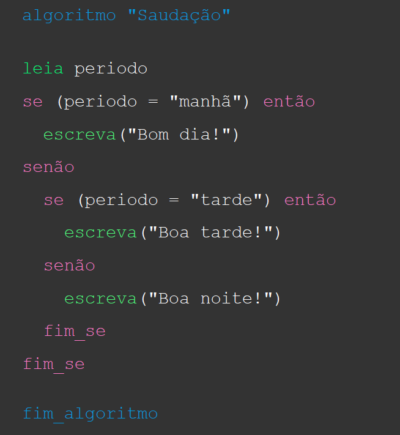

 

##### `Análise Léxica`
 

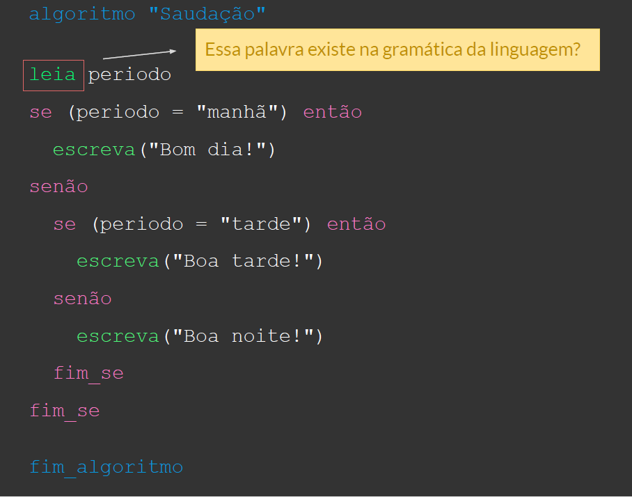

 

##### `Análise Sintática`

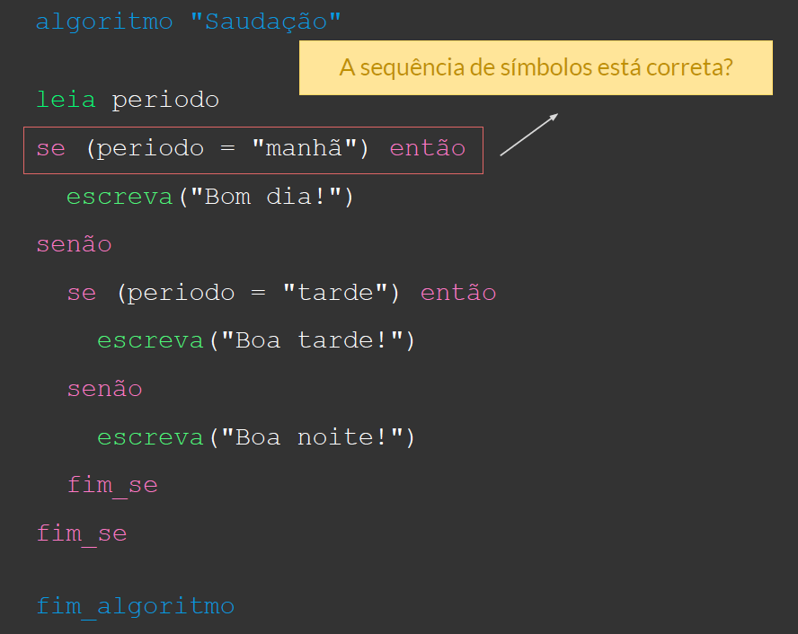

 

##### `Análise Semântica`

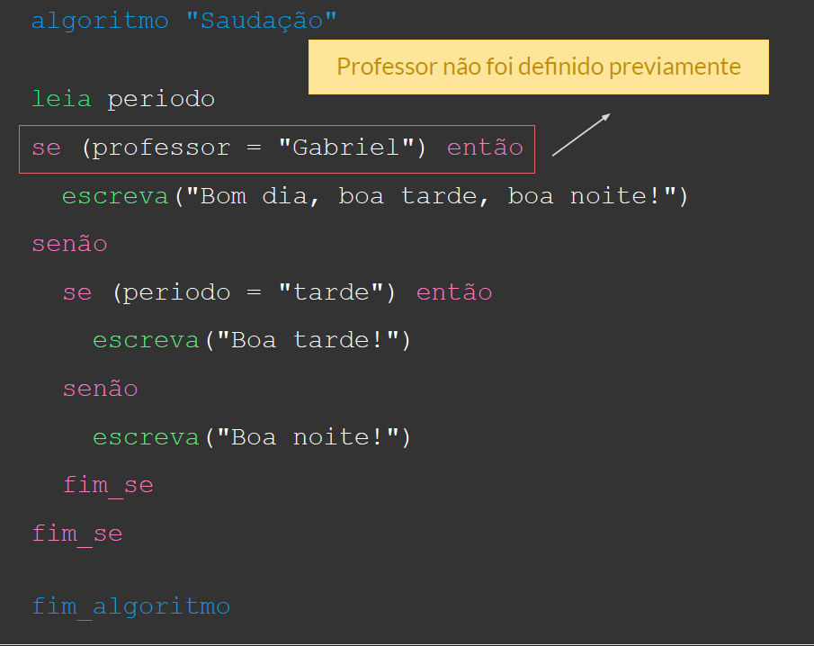

 

### `Léxico`:

- Responsável por reconhecer as `palavras reservadas`, constantes, identificadores e outras palavras que pertencem a linguagem de programação.

 

### `Sintático`:
- Responsável por `analisar a estrutura` do código fonte sem considerar seu significado na linguagem de programação.

 

### `Semântico`:
- Responsável por enfatizar a `interpretação` do código fonte, de modo a prever o resultado da execução do programa.

 

## Tópico 2 - Linguagens de Alto e Baixo Nível

 

### Esxitem linguagens de `Alto Nível` e `Baixo Nível`, mas qual a diferença?

 

#### `Alto Nível` :

- Sintaxe é voltada para o entendimento humano.

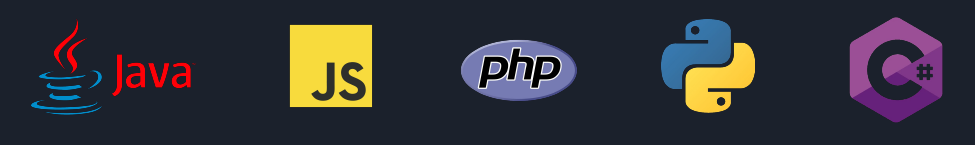

 

#### `Baixo Nível` :

- Abstraem conceitos voltados para a máquina e sintetizam comandos.
- Exemplo : ASSEMBLY

 

### Comparando a exibição de "Hello World" de uma linguagem de alto nível e baixo nível

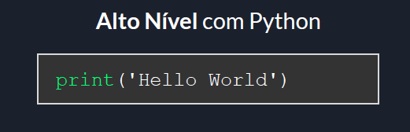

 

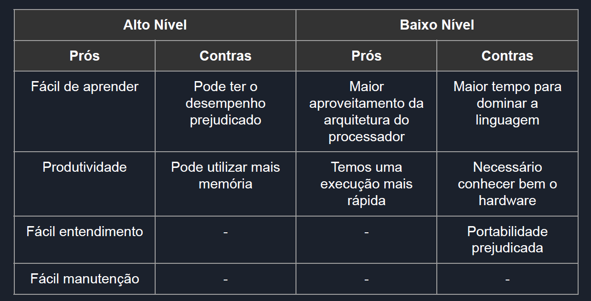

 

### Como a linguagem de programação se torna um programa de computador?

- Linguagem de baixo nível é "traduzida" pelo assembler, que converte o código Assembly em um conjunto de instruções na linguagem de máquina.

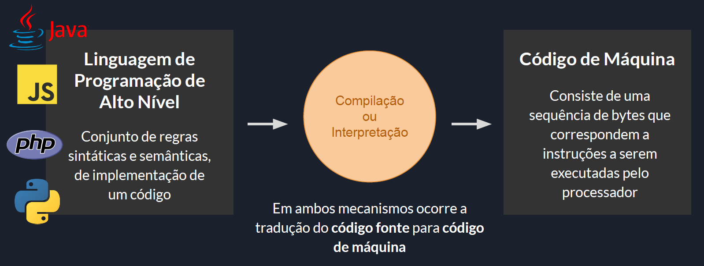

 

### `Linguagem Interpretada`:

- Se o `código` é executado à medida que vai sendo traduzido, como em `JavaScript`, por exemplo, num processo de tradução de trechos seguidos de sua execução imediata, então diz-se que o programa foi interpretado e que o mecanismo utilizado para a tradução é um `interpretador`.

 

### `Linguagem Compilada`:
- Se o método utilizado traduz todo o `código`, para só depois executar o software, então diz-se que o software foi `compilado` e que o mecanismo utilizado para a tradução é um compilador.

 

> Qual a MELHOR linguagem de programação?
> Qualquer linguagem de alto nível que você aprender será suficiente para sua jornada inicial.

 

## Tópico 3 - Compiladores

 

Compilador é um software essencial para programadores.

 

### Mas o que ocorre nesse processo de compilação do código fonte?

 

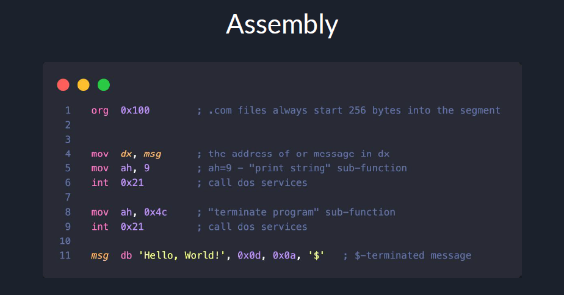

> Criar sistema de alto nível utilizando linguagens de baixo nível é inviável

Logo temos a ascensão das linguagens de alto nível para nos ajudar na criação de sistemas. Linguagens próximas da comunicação humana. Consequentemente precisávamos de um caminho para gerar a linguagem de máquina : `COMPILADORES`

- O compilador analisa linguagens de programação de alto nível e transforma em código de máquina

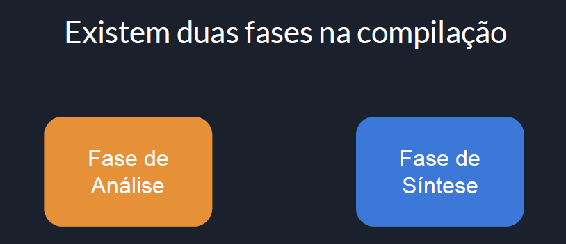

 

### `Fase de Análise`: 
- Divide o código fonte e cria uma representação intermediária do mesmo.
- Análise `léxica`, `sintática` e `semântica`.

### `Fase de Síntese`:
- Composta por módulos de geração e otimização de código de máquina a partir da geração intermediária.

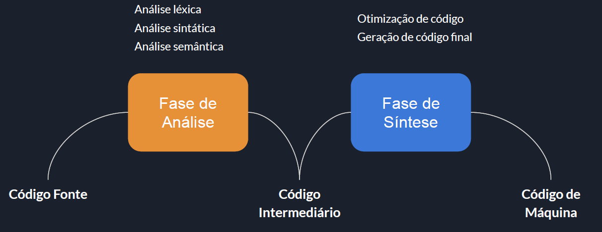

 

## Tópico 4 - Pra que serve HTML

 

### O que é uma linguagem de marcação? 

## Tópico 5 - Para que serve CSS

 

## Tópico 6 - Como pesquisar erros/duvidas de código no google

 

## Tópico 7 - Como pesquisar erros/duvidas de código no stack overflow

